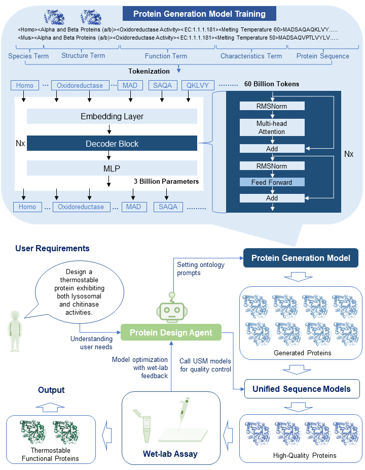
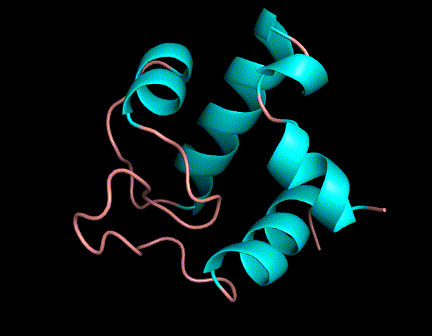
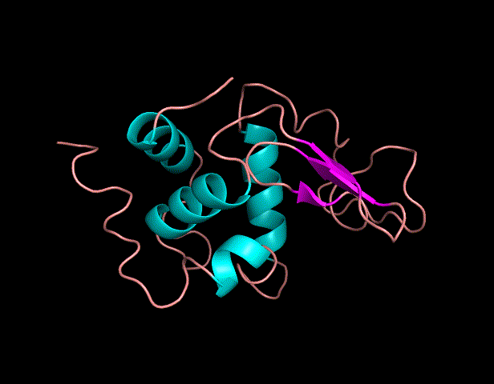
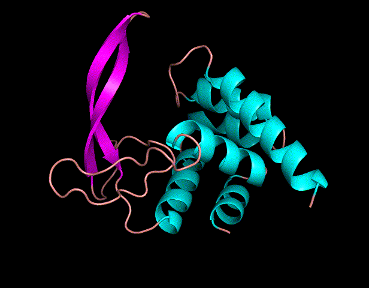

# ORI


--------------------------------------------------------------------------------
[English](README.md) | 简体中文

这个仓库是腾讯AI生命科学实验室的ORI蛋白质设计仓库。包括蛋白质生成、蛋白质属性预测、蛋白质基础模型强化学习等工程。

<div align="center">
  
</div>

> **De Novo Design of Functional Proteins with ORI**\
> Bin He*, Jianhuayao*\
> Paper: https://arxiv.org/abs/xxxxx

<table>
    <tr>
        <td align="center">
            
            <figcaption>TX-L2</figcaption>
        </td>
      <td align="center">
        
        <figcaption>TX-L6</figcaption>
      </td>
      <td align="center">
        
        <figcaption>Hen Lysozyme</figcaption>
      </td>
    </tr>
</table>

# 主要模型

<table>
    <tr>
        <td>项目</td>
        <td>模型</td>
        <td>数据集</td>
        <td>描述</td>
    </tr>
    <tr>
        <td rowspan="2"><a href="projects/progen/README.md">Protein Generation</a></td>
        <td>ORI-PGM-1B</td>
        <td>Uniref50,PDB</td>
        <td>ORI protein generation 1B model</td>
    </tr>
    <tr>
        <td>ORI-PGM-3B</td>
        <td>Uniref50, PDB</td>
        <td>ORI protein generation 3B model</td>
    </tr>
    <tr>
        <td rowspan="4"><a href="projects/prodiscriminator/README.md">Protein Discriminator</a></td>
        <td>USM-100M</td>
        <td>Uniclust30, Uniref50</td>
        <td>USM 100M mono sequence and msa foundation model</td>
    </tr>
    <tr>
        <td>USM-100M-Solubility</td>
        <td>Solubility dataset</td>
        <td>USM 100M solubility prediction model</td>
    </tr>
    <tr>
        <td>USM-100M-Thermostablility</td>
        <td>Thermostablility dataset</td>
        <td>USM 100M thermostablility prediction model</td>
    </tr>
    <tr>
        <td>USM-100M-SignalP</td>
        <td>Signal peptide dataset</td>
        <td>USM 100M signal pepetide prediction model</td>
    </tr>
    <tr>
        <td rowspan="2"><a href="projects/xfold/README.md">xfold</a></td>
        <td>USMFold-100M(很快将会发布)</td>
        <td>Uniref50, PDB</td>
        <td>Superfast protein folding prediction model based on USM</td>
    </tr>
    <tr>
        <td>ESMFold</td>
        <td>Uniref50, PDB, AFDB</td>
        <td>Optimized ESMFold in ori program</td>
    </tr>
    <tr>
        <td><a href="projects/rlwf/README.md">RLWF</a></td>
        <td></td>
        <td></td>
        <td>湿实验反馈强化学习</td>
    </tr>
</table>

可以使用如下链接下载模型参数：

* [Tencent Weiyun Drive](https://share.weiyun.com/2IJb0PqD)
* [Google Drive](https://drive.google.com/drive/folders/1GKd5KrpC3ciGjUumL14g6Hnu-xuMCYZ2)
* [Zenodo](https://doi.org/10.5281/zenodo.14639034)

## 开始

### 安装

#### 系统要求
* Linux或者MacOS操作系统
* Python 3.8及以上版本
* Pytorch 2.0.0-2.4.0版本 
* 如果使用Nvidia显卡确保显存大于8G

### 开始安装
你可以额使用如下命令行安装开发环境，其他方式请参考 [INSTALL.md](docs/INSTALL.md).

```shell
# download code
git clone https://github.com/TencentAI4S/ori.git
cd ori
# install miniconda
wget -O minicnda3.sh https://repo.anaconda.com/miniconda/Miniconda3-py39_24.5.0-0-Linux-x86_64.sh
# specific miniconda install path
CONDA_PATH=/miniconda
bash minicnda3.sh -b -p ${CONDA_PATH}
rm minicnda3.sh
# init environment
conda init
conda env create -n ori -f environment.yml
conda activate ori
```

### 1. 蛋白质生成

#### 溶菌酶生成

```shell
prompt="<Glucosaminidase><temperature90><:>"
python projects/progen/generate_protein.py -p ${prompt} -n 5
```

#### 高温PET酶生成

```shell
prompt="<EC:3.1.1.101><temperature90><:>"
python projects/progen/generate_protein.py -p ${prompt} -n 5
```

#### 1. 多功能酶生成

```shell
prompt="<EC:3.2.1.14><EC:3.2.1.17><temperature60><:>"
python projects/progen/generate_protein.py -p ${prompt} -n 5
```

### 2. 蛋白质水溶性预测

```shell
python projects/prodiscriminator/predict_solubility.py -i projects/prodiscriminator/data/solubility_demo.fasta
```

### 3. 蛋白质热稳定性预测

```shell
python projects/prodiscriminator/predict_thermostability.py -i projects/prodiscriminator/data/thermostability_demo.fasta
```

### 4. 信号肽预测

```shell
python projects/prodiscriminator/predict_signal_peptide.py -i projects/prodiscriminator/data/signalp_demo.fasta
```

### 5. USMFold蛋白质结构预测

```shell
python projects/xfold/usmfold_predict.py -i projects/xfold/data/test.fasta
```

## Citation

If you use this codebase, or otherwise find our work valuable, please cite ori:

```
@article{ori,
  title={De Novo Design of Functional Proteins with ORI},
  author={Bin He,Chenchen Qin...Jianhuayao},
  journal={arXiv preprint arXiv:xxx},
  year={2025}
}