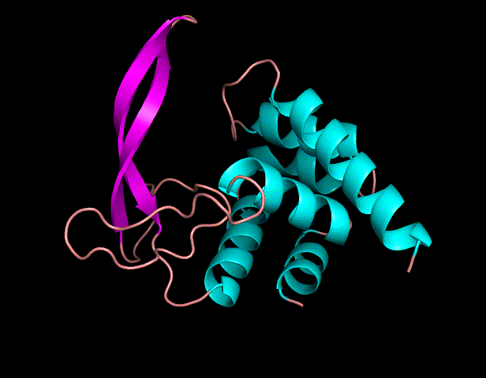

# ORI


--------------------------------------------------------------------------------

English | [简体中文](README-zh.md)

--------------------------------------------------------------------------------

# About

This repository is the ORI protein design warehouse of Tencent AI For Life Sciences Lab, including projects such as
protein generation, protein attribute prediction and protein basic model reinforcement learning.

<div align="center">
  
</div>

> **De Novo Design of Functional Proteins with ORI**\
> Bin He, Chenchen Qin...Jianhuayao\
> Paper: https://arxiv.org/abs/xxxxx

<table>
    <tr>
        <td align="center">
            
            <figcaption>TX-L2</figcaption>
        </td>
      <td align="center">
        
        <figcaption>TX-L6</figcaption>
      </td>
      <td align="center">
        
        <figcaption>Hen Lysozyme</figcaption>
      </td>
    </tr>
</table>

# Main Models

<table>
    <tr>
        <td>Project</td>
        <td>Model</td>
        <td>Dataset</td>
        <td>Description</td>
    </tr>
    <tr>
        <td rowspan="2"><a href="projects/progen/README.md">Protein Generation</a></td>
        <td>ORI-PGM-1B</td>
        <td>Uniref50,PDB</td>
        <td>ORI protein generation 1B model</td>
    </tr>
    <tr>
        <td>ORI-PGM-3B</td>
        <td>Uniref50, PDB</td>
        <td>ORI protein generation 3B model</td>
    </tr>
    <tr>
        <td rowspan="4"><a href="projects/prodiscriminator/README.md">Protein Discriminator</a></td>
        <td>USM-100M</td>
        <td>Uniclust30, Uniref50</td>
        <td>USM 100M mono sequence and msa foundation model</td>
    </tr>
    <tr>
        <td>USM-100M-Solubility</td>
        <td>Solubility dataset</td>
        <td>USM 100M solubility prediction model</td>
    </tr>
    <tr>
        <td>USM-100M-Thermostablility</td>
        <td>Thermostablility dataset</td>
        <td>USM 100M thermostablility prediction model</td>
    </tr>
    <tr>
        <td>USM-100M-SignalP</td>
        <td>Signal peptide dataset</td>
        <td>USM 100M signal pepetide prediction model</td>
    </tr>
    <tr>
        <td rowspan="2"><a href="projects/xfold/README.md">xfold</a></td>
        <td>USMFold-100M(will be released soon)</td>
        <td>Uniref50, PDB</td>
        <td>Superfast protein folding prediction model based on USM</td>
    </tr>
    <tr>
        <td>ESMFold</td>
        <td>Uniref50, PDB, AFDB</td>
        <td>Optimized ESMFold in ori program</td>
    </tr>
    <tr>
        <td><a href="projects/rlwf/README.md">RLWF</a></td>
        <td></td>
        <td></td>
        <td>Reinforcement Learning from Wet-lab Feedback</td>
    </tr>
</table>

you can download pre-trained weights with following link:

* [Tencent Weiyun Drive](https://share.weiyun.com/2IJb0PqD)
* [Google Drive](https://drive.google.com/drive/folders/1GKd5KrpC3ciGjUumL14g6Hnu-xuMCYZ2)
* [Zenodo](https://doi.org/10.5281/zenodo.14639034)

## Getting Started

### Install

#### Requirements
* System: Linux and MacOS
* Python 3.8 and above
* Pytorch 2.0.0 and above, no more than 2.4.0 
* If you use Nvidia GPU, make sure the memory is greater than 8G

### To install

You can install the package with the following command line. For other installation methods and options, please refer
to [INSTALL.md](docs/INSTALL.md).

```shell
# install miniconda
wget -O minicnda3.sh https://repo.anaconda.com/miniconda/Miniconda3-py39_24.5.0-0-Linux-x86_64.sh
# specific miniconda install path
CONDA_PATH=/miniconda
bash minicnda3.sh -b -p ${CONDA_PATH}
rm minicnda3.sh
# init environment
conda init
# download code
git clone https://github.com/TencentAI4S/ori.git
cd ori
conda env create -n ori -f environment.yml
conda activate ori
```

### Download Model Weights(Optional)
if you want to test model offline, please download model weights to "~/.cache/torch/hub/checkpoints" first.
* [Tencent Weiyun Drive](https://share.weiyun.com/2IJb0PqD)
* [Google Drive](https://drive.google.com/drive/folders/1GKd5KrpC3ciGjUumL14g6Hnu-xuMCYZ2)
* [Zenodo](https://doi.org/10.5281/zenodo.14639034)

### 1. Protein Generation

#### Lysozyme Generation

```shell
prompt='<Glucosaminidase><temperature90><:>'
python projects/progen/generate_protein.py -p ${prompt} -n 5
```

#### Enzyme Generation

```shell
prompt='<EC:3.1.1.101><temperature90><:>'
python projects/progen/generate_protein.py -p ${prompt} -n 5
```

#### Multifunctional Enzyme Generation

```shell
prompt='<EC:3.2.1.14><EC:3.2.1.17><temperature60><:>'
python projects/progen/generate_protein.py -p ${prompt} -n 5
```

### 2. Protein Solubility Prediction

```shell
python projects/prodiscriminator/predict_solubility.py -i projects/prodiscriminator/data/solubility_demo.fasta
```

### 3. Protein Thermostablility Prediction

```shell
python projects/prodiscriminator/predict_thermostability.py -i projects/prodiscriminator/data/thermostability_demo.fasta
```

### 4. Signal Peptide Prediction

```shell
python projects/prodiscriminator/predict_signal_peptide.py -i projects/prodiscriminator/data/signalp_demo.fasta
```

### 5. Protein Fold Prediction with USMFold

```shell
python projects/xfold/usmfold_predict.py -i projects/xfold/data/test.fasta
```

## Citation

If you use this codebase, or otherwise find our work valuable, please cite ori:

```
@article{ori,
  title={De Novo Design of Functional Proteins with ORI},
  author={Bin He,Chenchen Qin...Jianhuayao},
  journal={arXiv preprint arXiv:xxx},
  year={2025}
}