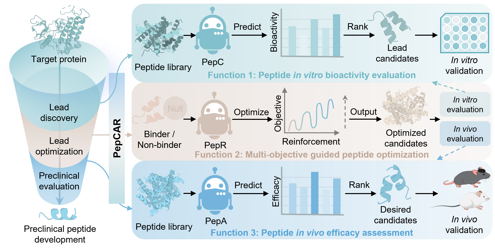

```markdown
# PepCAR

PepCAR is an AI toolkit that integrates cross-domain knowledge transfer, self-distillation, and reinforcement learning for peptide screening and optimization.
```



## Installation and Setup

1. **Hardware requirements**:
   This project requires only a standard computer with enough RAM and a NVIDIA GPU to support operations. We ran the demo using the following specs:
   - CPU: 10 cores, 2.5 GHz/core
   - RAM: 40GB
   - GPU: NVIDIA TESLA P40, V100, A100
   - CUDA: 11.0

2. **System requirements**:
   This tool is supported for Linux. The tool has been tested on the following system:

   - CentOS Linux release 8.2.2.2004

3. **Clone the Repository**:
   ```bash
   git clone https://github.com/TencentAI4S/ori.git
   cd ori/projects/PepCAR
   ```

4. **Install Required Packages**:
   The basic environment requirements are:
   - Python: 3.10
   - CUDA: 11.0

   Use the following command to install the necessary packages as specified in the `requirements.txt` file:

   ```bash
   conda create -n PepCAR python==3.10
   conda activate PepCAR
   pip install -r requirements.txt
   ```

5. **Download Model Weights**:

   Download the `model_weights.zip` file and extract it to the `PepCAR/model_weights` directory. The model_weights.zip is available on Zenodo: <https://doi.org/10.5281/zenodo.16939484>

   After extraction, the `PepCAR/model_weights` directory should contain the following:

   ```plaintext
   PepCAR/model_weights/
   ├── ESM-2/
   ├── ESM-Pep/
   ├── PepA_first_stage/
   ├── PepA_second_stage/
   ├── PepC/
   └── PepC_pmhc
   ```

6. **Download PDBBind Data**:

   Download the `pdbbind_data.zip` file and extract it to the `PepCAR/PepC` directory, specifically to `PepCAR/PepC/pdbbind_data`. The pdbbind_data.zip is available on Zenodo: <https://doi.org/10.5281/zenodo.16939484>

   After extraction, the `PepCAR/PepC/pdbbind_data` directory should contain the following:

   ```plaintext
   PepCAR/PepC/pdbbind_data/
   ├── all_data.tsv
   ├── pep/
   └── pro/
   ```

7. **Download Antigen-HLA Data**:

   Download the `pmhc_data.zip` file and extract it to the `PepCAR/PepC` directory, specifically to `PepCAR/PepC/pmhc_data`. The pmhc_data.zip is available on Zenodo: <https://doi.org/10.5281/zenodo.16939484>

   After extraction, the `PepCAR/PepC/pmhc_data` directory should contain the following:

   ```plaintext
   PepCAR/PepC/pmhc_data/
   ├── test_data.tsv
   ├── mhc/
   └── pep/
   ```
  
8. **Download Receptor Data**:

   Download the `receptor_data.zip` file and extract it to the `PepCAR/PepC` directory, specifically to `PepCAR/PepC/receptor_data`. The receptor_data.zip is available on Zenodo: <https://doi.org/10.5281/zenodo.16939484>

   After extraction, the `PepCAR/PepC/receptor_data` directory should contain the following:

   ```plaintext
   PepCAR/PepC/receptor_data/
   ├── coordinates.json
   ├── mod_rec_seq.json
   ├── rec_interface.json
   ├── supported_receptor_pdbid.txt
   └── esm/
   ```

---

## Quick Start
   To quickly get started with PepCAR, you can use the provided automation script. Follow these steps:

1. **Run the Automation Script**:
   After setting up the environment and downloading the necessary files, you can run the automation script to start an example task easily.

      ```bash
      python quick_start.py
      ```
   This will present you with a menu to select from the following options:

   ```
    Welcome to the automation script for in vitro and in vivo prediciton, as well as peptide evolution!

    Please choose an option:
    1. Run PepC in vitro prediction for PDBbind
    2. Run PepC in vitro prediction for single pair
    3. Run PepC in vitro prediction for antigen-HLA
    4. Run PepA in vivo prediction (first-stage)
    5. Run PepA in vivo prediction (second-stage)
    6. Run peptide evolution
    7. Exit
    Enter your choice (1-7):
   ```

   1. **Run PepC prediction for PDBbind**
   - Select option 1 allows you to perform a binding affinity prediction for the PDBBind dataset.
   ```
   Enter your choice (1-7): 1
   Running command: cd PepC && python predict.py --task pdbbind
   Results were saved in PepC/output/pdbbind.tsv
   ```
   2. **Run PepC prediction for single pair**
   - Selection option 2 allows you to perform a binding affinity prediction for a given protein and a peptide. If you want to specify parameters such as the target protein and the peptide sequence, please refer to Further instructions 2.
   ```
    Enter your choice (1-7): 2
    Running command: cd PepC && python predict.py --task single
    Starting prediction for protein: 5yqz_R, peptide: HSQGTFTSDYSKYLDSERAQEFVQWLENE
    Dataset created.
    Models loaded successfully.
    Predicted binding affinity between 5yqz_R and HSQGTFTSDYSKYLDSERAQEFVQWLENE: 10.12
   ```

   3. **Run PepC prediction for antigen-HLA**
   - Selection option 3 allows you to perform a binding affinity prediction for the antigen-HLA test data. If you want to specify parameters such as the input data, please refer to Further instructions 3.
   ```
   Enter your choice (1-7): 3
   Running command: cd PepC && python predict.py --task pmhc
   Building data ...
   Predicting...
   Results were saved in PepC/output/pmhc.tsv
   ```

   4. **Run PepA prediction (first stage, ADMET)**
   - Selection option 4 allows you to perform a ADMET prediction for a given peptide sequence. If you want to specify parameters such as the input data, please refer to Further instructions 4.
   ```
   Enter your choice (1-7): 4
   Running command: cd PepA && python predict.py --task admet
   Starting prediction for peptide: XXXXXXXXXXXXX
   Dataset created.
   Models loaded successfully.
   ADMET Property [ames]: ...
   ADMET Property [bbb]: ...
   ADMET Property [cyp]: ...
   ADMET Property [logd]: ...
   ADMET Property [microsomal_cl]: ...
   ADMET Property [ppb]: ...
   ADMET Property [solubility]: ...
   ```

   5. **Run PepA prediction (second stage, stability)**
   - Selection option 5 allows you to perform a stability prediction for a given peptide sequence. If you want to specify parameters such as the input data, please refer to Further instructions 5.
   ```
   Enter your choice (1-7): 5
   Running command: cd PepA && python predict.py --task stability
   Starting prediction for peptide: XXXXXXXXXXXXX
   Dataset created.
   Models loaded successfully.
   Stability [invitro-based]: ...
   Stability [invivo-based]: ...
   ```

   6. **Run peptide evolution**
   - Select option 6 will start the Reinforcement Learning (RL) optimization process. This process will optimize the given peptide sequence targeting a specific protein (pdb id) to search better mutated sequences with higher affinity. If you want to specify parameters such as the target protein and the initial peptide sequence, please refer to Further instructions 2.
   ```
    Enter your choice (1-7): 6
    Running command: cd PepR && sh run.sh
    Target PDB: 7lll_R, Start sequence: TFQKWAAVVVPSG
    ################## model loaded on cuda #####################
    ######### 1-th Play ###########
    Mutated seq TFRKWAAVVVPSG
    Mutated seq TFREWAAVVVPSG
    Mutated seq TFRIWAAVVVPSG
    Mutated seq PFRIWAAVVVPSG
    ######### 2-th Play ###########
    Mutated seq TFRIGAAVVVPSG
    ######### 3-th Play ###########
    Mutated seq TFRIWAAVVVSSG
    ...
   ```

   7. **Exit:**
   - Choosing this option will exit the script and terminate the current session.

   Simply enter the corresponding number to execute your desired task.

---

## Further Instructions
### 1. Run PepC prediction for PDBbind

Navigate to the `PepC` directory and run the example code:
```bash
cd PepCAR/PepC
python predict.py --task pdbbind
```
This will utilize five models to predict the final results.


### 2. Run PepC prediction for single pair

A list of supported PDB IDs (35,473) can be found in `PepCAR/PepC/receptor_data/supported_receptor_pdbid.txt`.

Since PepC requires various features for prediction, we support an approache to simply use PepC:

Use the built-in feature extraction by specifying the target PDB ID and peptide sequence in `predict.py`:
```bash
cd PepCAR/PepC
python predict.py --task single
```

### 3. Run PepC prediction for antigen-HLA
Navigate to the `PepC` directory and run the example code:

```bash
cd PepCAR/PepC
python predict.py --task pmhc
```

If you want to test self-data, please use AlphaFold2 to predict the complete HLA structure, and use ESM2 and ESM-pep to extract evolutionary embeddings for HLA and antigen sequences.

### 4. Run PepA prediction (first stage, ADMET)

Use the built-in feature extraction by specifying the peptide sequence in `predict.py`:
```bash
cd PepCAR/PepA
python predict.py --task admet
```

### 5. Run PepA prediction (second stage, stability)

Use the built-in feature extraction by specifying the peptide sequence in `predict.py`:
```bash
cd PepCAR/PepA
python predict.py --task stability
```

### 6. Run peptide evolution

Navigate to the `PepR` directory and run the optimization script:
```bash
cd PepCAR/PepR
sh run.sh
```

#### Key Parameter Explanations:
- `PLAYOUT_NUM=20`: The number of rounds for each game.
- `NITER=100`: The number of optimization iterations.
- `WORKDIR='./'`: The working directory.
- `PDBID='7lll_R'`: The PDB ID of the target protein.
- `SEQ='QDEEGLLLMQSLEMS'`: The peptide sequence to be optimized.
- `OUTPUT_DIR="./results/${PDBID}/${SEQ}"`: The directory for output results.

A list of supported PDB IDs can be found in `PepCAR/PepC/receptor_data/supported_receptor_pdbid.txt`.