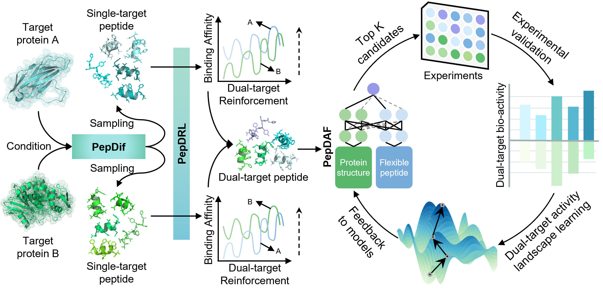

```markdown
# ORIDTP

ORIDTP is a toolkit for de novo dual-target peptide generation, mutation optimization, and protein-peptide affinity prediction. This project includes multiple modules for different tasks.
```


## Installation and Setup

1. **Hardware requirements**:
   This project requires only a standard computer with enough RAM and a NVIDIA GPU to support operations. We ran the demo using the following specs:
   - CPU: 10 cores, 2.5 GHz/core
   - RAM: 40GB
   - GPU: NVIDIA TESLA P40, V100, A100
   - CUDA: 11.0

2. **System requirements**:
   This tool is supported for Linux. The tool has been tested on the following system:

   - CentOS Linux release 8.2.2.2004

3. **Clone the Repository**:
   ```bash
   git clone https://github.com/TencentAI4S/ori.git
   cd ori/projects/oridtp
   ```

4. **Install Required Packages**:
   The basic environment requirements are:
   - Python: 3.10
   - CUDA: 11.0

   Use the following command to install the necessary packages as specified in the `requirements.txt` file:

   ```bash
   conda create -n ORIDTP python==3.10
   conda activate ORIDTP
   pip install -r requirements.txt
   ```

5. **Download Model Weights**:

   Download the `model_weights.zip` file and extract it to the `ORIDTP/model_weights` directory. The model_weights.zip is available on Zenodo: <https://doi.org/10.5281/zenodo.15597537>

   After extraction, the `ORIDTP/model_weights` directory should contain the following:

   ```plaintext
   ORIDTP/model_weights/
   ├── ESM-2/
   ├── ESM-Pep/
   ├── PepAF/
   └── PepDif/
   ```
   
6. **Download Receptor Data**:

   Download the `receptor_data.zip` file and extract it to the `ORIDTP/PepDAF` directory, specifically to `ORIDTP/PepDAF/receptor_data`. The receptor_data.zip is available on Zenodo: <https://doi.org/10.5281/zenodo.15597537>

   After extraction, the `ORIDTP/PepDAF/receptor_data` directory should contain the following:

   ```plaintext
   ORIDTP/PepDAF/receptor_data/
   ├── coordinates.json
   ├── mod_rec_seq.json
   ├── rec_interface.json
   ├── supported_receptor_pdbid.txt
   └── esm/
   ```
---

## Quick Start
   To quickly get started with ORIDTP, you can use the provided automation script. Follow these steps:

1. **Run the Automation Script**:
   After setting up the environment and downloading the necessary files, you can run the automation script to start an example task easily.

      ```bash
      python run_oridtp.py
      ```
   This will present you with a menu to select from the following options:
   ```
   Welcome to the ORIDTP automation script!

   Please choose an option:
    1. Run PepDif generation (Generic model)
    2. Run PepDif generation (GLP1R&GCGR enhanced model)
    3. Run PepDRL optimization
    4. Run single prediction in PepDAF
    5. Run batch prediction in PepDAF
    6. Exit
   Enter your choice (1-6):
   ```

   1. **Run PepDif generation (Generic model)**
   - Select option 1 will initiate the PepDif model (Generic type) to generate diverse peptide sequences for given target proteins. This model leverages conditional diffusion and self-distillation techniques to produce peptide sequences with potential biological activity. If you want to specify parameters such as the input protein sequence, please refer to Further instructions 1.
   ```
   Enter your choice (1-6): 1
   Running command: cd PepDif/scripts && sh run_decode.sh
    ### Creating model and diffusion...
    ### The parameter count is 87416936
    ### Sampling...on test
    ...
    ### Total takes 249.90s .....
    ### Written the decoded output to generation_outputs_1/PepDif/seed123_step0.json
   ```
   2. **Run PepDif generation (GLP1R&GCGR enhanced model)**
   - Select option 2 will initiate the PepDif model (GLP1R&GCGR enhanced type) to generate diverse peptide sequences for GLP1R and GCGR. This model was further enhanced with virtual feedback on GLP-1R/GCGR targets.
   ```
   Enter your choice (1-6): 2
   Running command: cd PepDif/scripts && sh run_decode_glp1rgcgr.sh
    ### Creating model and diffusion...
    ### The parameter count is 87416936
    ### Sampling...on test
    ...
    ### Total takes 169.21s .....
    ### Written the decoded output to generation_outputs_glp1rgcgr_1/PepDif/seed123_step0.json
   ```

   3. **Run PepDRL optimization**
   - Select option 3 will start the dual-target Reinforcement Learning (RL) optimization process. This process will optimize the given peptide sequence targeting two specific proteins (pdb id) to search better mutated sequences with higher affinity. If you want to specify parameters such as the target protein and the initial peptide sequence, please refer to Further instructions 2.

   ```
   Enter your choice (1-6): 3
   Running command: cd PepDRL && sh run.sh
   Target PDB: 7lll_R and 5yqz_R, Start sequence: HSQGTFTSDYSKYLDSQGRDFVQWLWLAGG
   The current date and time is ...
   ################## model loaded on cuda #####################
   ######### 1-th Play ###########
   Mutated seq HSQGTFTSDYSKYLDSQPRDFVQWLWLAGG
   ######### 2-th Play ###########
   Mutated seq HSQGTFTSDYSKYLDSQGRDFVQTLWLAGG
   ...
   Output directory: 
   ./results/7lll_R+5yqz_R/HSQGTFTSDYSKYLDSQGRDFVQWLWLAGG
   ```

   4. **Run single prediction in PepDAF**
   - Selection option 4 allows you to perform a binding affinity for a given protein and a peptide. If you want to specify parameters such as the target protein and the peptide sequence, please refer to Further instructions 3.
   ```
   Enter your choice (1-6): 4
   Running command: cd PepDAF && python predict.py --task single
   Starting prediction for protein: 3dab_G, peptide: TSFAEYWNLLSP
   Dataset created.
   Models loaded successfully.
   Predicted binding affinity between 3dab_G and TSFAEYWNLLSP: 7.570078659057617
   ```

   5. **Run batch prediction in PepDAF**
   - Selection option 5 allows you to conduct batch predictions for multiple peptide sequences. This is particularly useful when you need to asess a large number of peptide sequences simultaneously. If you want to specify parameters such as the target protein and the peptide sequences, please refer to Further instructions 3.
   ```
   Enter your choice (1-6): 5
   Running command: cd PepDAF/utils/preprocess && sh start.sh
   Starting the process...
   Creating DataFrame...
   DataFrame created successfully.
   Adding SMILES data...
   Converting peptide TSV to JSON...
   Converting peptides to FASTA format...
   Creating directory for IDs...
   Changing directory to ../iupred...
   Calculating matrix...
   Merging results...
   Merging completed successfully.
   Extracting peptide embeddings...
   Extracting protein embeddings...
   Process completed successfully.
   Running command: cd PepDAF && python predict.py --task batch
   Results have been saved in PepDAF/output/batch.tsv
   ```

   6. **Exit:**
   - Choosing this option will exit the script and terminate the current session.
   ```
   Enter your choice (1-6): 6
   Exiting the script.
   ```
   Simply enter the corresponding number to execute your desired task.


---

## Further Instructions
### 1. Generate New Peptides Using PepDif

Navigate to the `PepDif/scripts` directory.
If you want to use the generic model, please run the example code:
```bash
cd PepDif/scripts
sh run_decode.sh
```
The target protein sequences can be changed in `PepDif/pepdif/example/test.jsonl`

If you want to use the GLP1R/GCGR enhanced model, please run the example code:
```bash
cd ORIDTP/PepDif/scripts
sh run_decode_glp1rgcgr.sh
```

#### Key Parameter Explanations:
- `--model_path`: The trained model path.
- `--seed`: The random seed.
- `--top_p`: The top p to sample.
- `--step`: The sampling step.
- `--bsz`: The batch size.

### 2. Optimize Peptide Mutations Using PepDRL and PepDAF

Navigate to the `PepRL` directory and run the optimization script:
```bash
cd ORIDTP/PepDRL
sh run.sh
```

#### Key Parameter Explanations:
- `PLAYOUT_NUM=20`: The number of rounds for each game.
- `NITER=100`: The number of optimization iterations.
- `WORKDIR='./'`: The working directory.
- `PDBID='7lll_R'`: The PDB ID of the first target protein.
- `SECOND_PDBID='5yqz_R'`: The PDB ID of the second target protein.
- `SEQ='HSQGTFTSDYSKYLDSQGRDFVQWLWLAGG'`: The peptide sequence to be optimized.
- `OUTPUT_DIR="./results/${FIRST_PDBID}+${SECOND_PDBID}/${SEQ}"`: The directory for output results.

A list of supported PDB IDs can be found in `ORIDTP/PepDAF/receptor_data/supported_receptor_pdbid.txt`.

### 3. Predict Protein-Peptide Affinity Using PepDAF

A list of supported PDB IDs can be found in `ORIDTP/PepDAF/receptor_data/supported_receptor_pdbid.txt`.

Since PepDAF requires various features for prediction, we support two approaches to use PepDAF:

#### 3.1 Single Protein-Peptide Prediction

Use the built-in feature extraction by specifying the target PDB ID and peptide sequence in `predict.py`:
```bash
cd ORIDTP/PepDAF
python predict.py --task single
```

#### 3.2 Batch Calculation for Single Protein and Multiple Peptides

First, navigate to the feature extraction directory and run:
```bash
cd ORIDTP/PepDAF/utils/preprocess
sh start.sh
```
You can modify the `target.txt` and `peptide.txt` files to set the target and peptide sequences.

Then, return to the `PepDAF` directory and run batch prediction:
```bash
cd ORIDTP/PepDAF
python predict.py --task batch
```